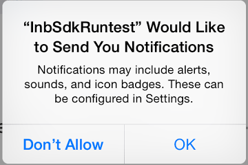
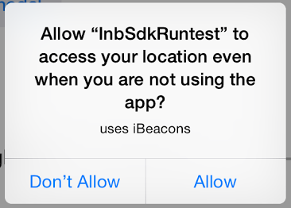
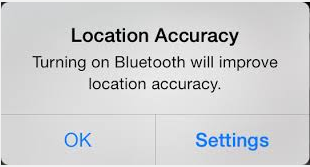
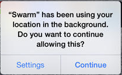

# Getting Started

Both the Android and the iOS parts of this component can be implemented in a Cordova project by following the regular instructions for [Android](https://github.com/inbeacon/InbeaconSdk-android) and [iOS](https://github.com/inbeacon/InbeaconSdk-IOS) native apps as provided by inBeacon

These instructions assume you already have an account at[ inBeacon](https://inbeacon.nl/) and are in possession of an Client ID and Client Secret. You can find your client-ID and client-Secret in your [account overview](https://console.inbeacon.nl/account) 

## Android details

### Add required permissions to the manifest

In the Properties/AndroidManifest.xml, add the following permissions:

```xml
<uses-permission android:name="android.permission.BLUETOOTH" /> 
<uses-permission android:name="android.permission.ACCESS_FINE_LOCATION" /> 
<uses-permission android:name="android.permission.ACCESS_COARSE_LOCATION" /> 
<uses-permission android:name="android.permission.RECEIVE_BOOT_COMPLETED"/>
```
Also add the following inside the <application></application> block:

```xml
<receiver android:name="org.altbeacon.beacon.startup.StartupBroadcastReceiver">
	<intent-filter>
		<action android:name="android.intent.action.BOOT_COMPLETED" />
		<action android:name="android.intent.action.ACTION_POWER_CONNECTED" />
		<action android:name="android.intent.action.ACTION_POWER_DISCONNECTED" />
	</intent-filter>
</receiver>

<service android:enabled="true" android:exported="false" android:isolatedProcess="false" android:label="beacon" android:name="org.altbeacon.beacon.service.BeaconService" />

<service android:name="org.altbeacon.beacon.BeaconIntentProcessor" android:enabled="true" android:exported="false" />
```

## iOS details

### Permissions 

When the SDK is integrated, there are a few permissions needed from the user. If the app already needed those permissions before integration of the SDK,, there will be no change (they will not be requested twice). These permissions are requested once after installation when the app is run (and the inBeacon SDK is initialized). 

1. Application would like to send you notifications

	

2. Application would like to access your location even when you are not using the app. 

	
	
	It is also possible to run the SDK in "Geofenced Location Authorisation" mode (SDK 1.3.5). In this case the SDK asks for “when in use” access only, and asks for “even when you are not using the app” mode at the moment the user enters one of the predefined Geofences. 

3. When bluetooth is turned off:

	

4. After running a few days, the user gets a notification that the app is looking for beacons or geofences (even when no beacons or geofences are actually found). We found out that this message is always given in combination with message 2), and is not related to the actual location or iBeacon features used in the app.

	

	When the SDK is running in  "Geofenced Location Authorisation" mode, this message is not send until after the user has crossed one of the Geofences and has accepted “even when you are not using” location scanning.

### Background mode	

There are three fundamentally different ways to run the inBeacon SDK:

* full background mode
	For iOS, full background mode requires extra location background settings so the app is able to run continuously  in the background during iBeacon ranging. 

	Advantages:
	* When users approach an iBeacon in Near or Immediate proximity, all inBeacon triggers and other functionality is fully supported. During the complete stay of the user in the iBeacon location, the app will monitor the range to all defined iBeacons. 

	Disadvantages:
	
	* the app description in the app-store needs to include the following: "Note: Continued use of GPS and [app name] running in the background can dramatically decrease battery life. [app name] will automatically shut down if you run it in the background and leave [description of location where ibeacons are used]."
	* Possibility of initial app rejection by iTunes connect (apple appstore). However in the past we were able to get all apps approved, even with full background mode ON.
	* The app uses a bit more battery power when inside beacon regions. Because location monitoring is set for least-accurate, GPS is not used by the SDK. We found that the decrease of battery life is negligible.

* Restricted background mode. 
	If you don’t specify background modes, the app runs in restricted background mode. Restricted background mode notices ALL beacon regions enter/exit, even when the app is terminated or suspended (just like full background mode), but stops checking beacon proximity in the background 3 minutes after entering the region (location) 

	This means that if a user is approaching an iBeacon within a region more than 3 minutes after entering the region, triggers will no longer work when the app is in the background. 


	Advantages:
	
	* App submission to the app store is without issues about background location scanning
Battery power use is limited even more.

	Disadvantages:
	
	* This limits the app to a maximum of 3 minutes background processing when the app enters or leaves a beacon region. 

	
* Geofenced Location Authorisation mode. In this mode the app starts by only asking for "when in use" location permissions. Only when the user enters a predefined geofenced region, the app will ask for full (background) location permissions. Geofenced Location Authorisation is defined on the inBeacon backend. 

	Advantages:

	* all advantages of restricted background mode
	* only ask full permissions to the subset of your users that are within the geografic region where beacons are used.

	Disadvantages
	* all disadvantages of restricted background mode


Using full, restricted background mode or Geofenced Location Autorisation mode depends on your specific situation.

### App store submission

**Full background mode submission notes**

Only for full background mode special app store submission rules apply:

#### iTunes application notes

Because we use iBeacon ranging in the background  you need to include a note in your app description:

Please include the following battery use disclaimer in your Application Description:

*"Continued use of GPS running in the background can dramatically decrease battery life."*

We were able to get applications approved with the following text:

in English:

*Note: Continued use of GPS and <app name> running in the background can dramatically decrease battery life. <app name> will automatically shut down if you run it in the background and leave <description of location where ibeacons are used>*

in Dutch:

*Opmerking: Langdurig gebruik van GPS en <app naam> kan de levensduur van de accu drastisch verminderen. <app naam> zal automatisch afsluiten zodra u <omschrijving van de locatie waar de ibeacons worden gebruikt> verlaat.*

### Update Info.plist

iOS requires a text that explain why the app should be allowed to use the location services. Add the following keys to the Info.plist file and supply a string value with an explanation:

```xml
	<key>NSLocationAlwaysUsageDescription</key>
	<string>To detect iBeacons</string>
	<key>NSLocationWhenInUseUsageDescription</key>
	<string>To detect iBeacons</string>
```

If you want the inBeacon platform to run in continuous background mode see above), go to the bottom of the Info.plist file editor (section 'Background modes'), enable 'Enable Background Modes' and check 'Location updates'.

```xml
	<key>UIBackgroundModes</key>
	<array>
		<string>location</string>
	</array>
```

### Include audio resources

When using customized sounds with notifications, make sure to copy the audio files from the iOS SDK into your app. To do that, find the **./resources/*.caf** files in the iOS SDK and copy those files to the **./Resources** folder in your iOS project. Next, right-click on the files in Cordova and make sure that 'Build Action' is set to 'BundleResource'. The audio files can also be found in the sample project included in the component.

